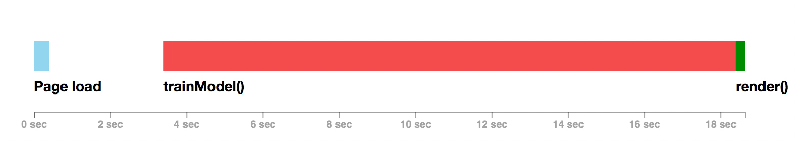
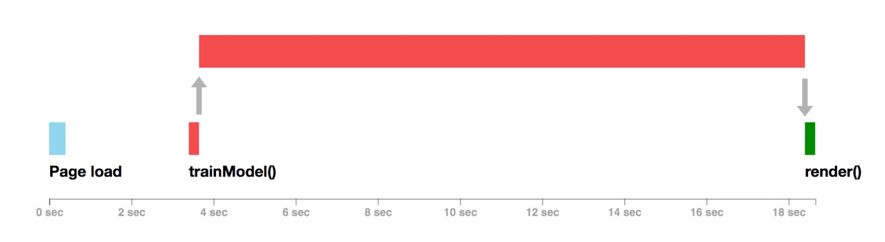

## Power Y'all: Applying R to electricity pricing in Texas

- Slides: <https://poweryall.github.io/dallas-rug-mvp1/>

<br>

**Mike Badescu, PhD**  

- [*mike*.*badescu@numeract*.*com*](*mike*.*badescu@numeract*.*com*)  
- @[MikeBadescu](https://twitter.com/MikeBadescu)  

<br>

**Dallas R Users Group**  
*November 17, 2018*


## About

<br>
<br>

- Data Science and Economics / Finance consulting services  
- Technology Stack: (Postgre)SQL, R, Python, Spark, Docker, AWS

<br>
<br>
<br>
<br>

- Current: demo / MVP / capabilities
- Future: public, available to everybody


## Summary 

1. Retail electricity market in Texas
2. Motivation
3. Plan Processing
4. Consumer Web App
5. Remarks
6. Future ...


## Retail electricity market in Texas

Status: **Deregulated**

- in many parts of Texas, consumers can choose their electricity company

<br>

Shopping for electricity involves:

- comparing provider prices, 
- reading fine print 
- ...
- taking a gamble


## Relevant Entities

- [Public Utility Commission of Texas](https://www.puc.texas.gov/) (PUCT)
- [Electric Reliability Council of Texas](http://www.ercot.com/) (ERCOT)
- Power Generation Companies
    + sell electricity wholesale
- Transmission and Distribution Service Providers (TDSPs)
    + [Oncor](http://www.oncor.com/EN/Pages/default.html) (Dallas area)
    + [CenterPoint](https://www.centerpointenergy.com/) (Houston area)
    + charge Transportation and Distribution Fees
- Retail Electric Providers (REPs)
    + sell electricity to consumers
    + 40-60 active REPs in Texas: e.g., TXU, Reliant, Champion, etc.


## Power To Choose (PTC)

[Power To Choose](http://www.powertochoose.org/) website

- Created by PUCT to help residential consumers
- REPs report prices to PTC
    + report Average Price / kWH at usage: 500, 1000 and 2000 kWh / month
- user: ZIP code => TDSP => Electricity Plans
- Default assumption: 1000 kWh / month
- Allows filtering
- Allows sorting by price
- Consumers select a plan, go to REP website and enter into a contract


## Power To Choose (PTC)

- Currently, about 170 plan for the Dallas area (Oncor) listed on PTC
    + There are 9 TDSPs
- Possible to export data (CSV format)
- The devil is in the detail, i.e. the fine print
    + Transportation and Distribution Fees
    + base charges
    + fees/credits depending on amount of electricity usage
    + energy charges
- REPs want to be ranked first when using the default settings
- PUCT walks a thin line

*Note: Several companies offer electricity comparison tools*


## Incomplete information for consumers

- Quality and functionality of the REP website not present
    + emails 
    + easy payment setup
    + security
    + user friendly
- Electricity usage not constant from month to month:
    + summer usage about 2x - 3x higher than early spring
- Electricity usage depends on:
    + house characteristics
    + habits (e.g. # kids leaving the door open)

**Ultimately, electricity usage is consumer specific!**


## Smart Meter Texas (SMT)

[Smart Meter Texas](https://www.smartmetertexas.com) portal

- For residential and business consumers with advanced meters
- Electricity usage for the last 12 month at 15 min intervals
- Registration is not easy
- Usability problems
- Consumers can allow third parties to receive usage data
- Major revisions planed in the next few years


## Incomplete information for REPs

- Expensive to acquire consumers
    + mail, TV ads, door to door salespeople
- Expensive to retain consumers
    + renewal discounts
- Difficult to build brand awareness
- Few REPs are aware of
    + changes competition offering
    + own website performance
    + why consumers switch
    

## Motivation

### **How to solve the problem?**

Five ~~easy~~ steps:

1. Download all plans
2. For each plan, construct its `Price(Usage)` function
3. Estimate your (future) monthly usage 
4. Calculate total cost (for each plan)
5. Pick the lowest cost plan that satisfies other subjective criteria


## Motivation

### **How to solve the problem _with R_?**

Tasks to accomplish:

- obtain the plan info
- connect to database
- calculation engine
- internal web app
- external (consumer) web app 
- scalable MVP
- use best practices


## Goal: use R throughout!

> - obtain the plan info  
    `httr`, `rvest`, `jsonlite`
> - connect to database  
    `DBI`, `RPostgres`, `aws.s3`
> - calculation engine  
    *NLP magic*, `pdftools`, `tidyverse`
> - internal web app / external (consumer) web app  
    `Shiny`, `ggplot2`, `DT`
> - scalable MVP  
    `future`, `plumber`
> - use best practices  
    `loggr`, `config`, `fs`, `pool`


## Plan Processing

- database: PostgreSQL
    + `jsonb` fields ==> can be indexed
    + https://www.postgresql.org/docs/10/functions-json.html
    + possible to avoid using a NOSQL DB (e.g., MongoDB)
- file storage
    + `aws.s3`: https://github.com/cloudyr/aws.s3
- `rmarkdown` reports
    + simple ["cron job"](https://www.ostechnix.com/a-beginners-guide-to-cron-jobs/)
    + **RStudio Connect** allow schedule of rmarkdown reports + email
- internal web app


## Consumer Web App

Simple (Synchronous) Shiny

- one (local) user
- single threaded

<br>

```{r echo=FALSE, out.width = '100%'}

```
*source: [Joe Cheng / RStudio](https://www.rstudio.com/resources/videos/scaling-shiny-apps-with-async-programming/)*


## Consumer Web App

Simple (Synchronous) Shiny

```{r eval = FALSE}
    plan_info_tdsp <- reactive({
        
        db_get_plan_info(user_tdsp = user_tdsp)  # connects to DB
    })
    
    valid_res <- reactive({
        plan_info_tdsp() %>% 
            dplyr::filter(status %in% "valid") %>%
            calc_cost_multi(usage_df)
    })
```


## Consumer Web App

Asynchronous Shiny

- asynchronous programming using `future` and `promises` packages
- ref: https://rstudio.github.io/promises/

```{r echo=FALSE, out.width = '100%'}

```
*source: [Joe Cheng / RStudio](https://www.rstudio.com/resources/videos/scaling-shiny-apps-with-async-programming/)*


## Consumer Web App

Asynchronous Shiny

```{r eval = FALSE}
    plan_info_tdsp <- reactive({
        future({
            db_get_plan_info(user_tdsp = user_tdsp)  # connects to DB
        }) 
    })
    
    valid_res <- reactive({
        plan_info_tdsp() %...>% {
            plan_df <- .
            plan_df <- dplyr::filter(plan_df, status %in% "valid")
            calc_cost_multi(plan_df, usage_df)
        }
    })
```


## Consumer Web App

API + Asynchronous Shiny

- create API based on json
- delegate processing to containers 
- server / container: use `plumber` to serve json object
- client / shiny app: use `httr` to get json object


## Consumer Web App

API + Asynchronous Shiny: shiny server code

```{r eval = FALSE}
    plan_info_tdsp <- reactive({
        future({
            pyapi_plan_info(user_tdsp = user_tdsp)  # call API (http GET)
        }) 
    })
    
    valid_res <- reactive({
        plan_info_tdsp() %...>% {
            plan_df <- .
            plan_df <- dplyr::filter(plan_df, status %in% "valid")
            calc_cost_multi(plan_df, usage_df)
        }
    })
```

## Consumer Web App

API + Asynchronous Shiny: calling API code

```{r eval = FALSE}
pyapi_plan_info <- function(user_tdsp) {
    
    rsp <- httr::GET(
        url = cfg$pyapi$endpoint, 
        port = cfg$pyapi$port,
        query = list(tdsp = user_tdsp)
    )
    
    rsp %>%
        httr::content(as = "text", encoding = "UTF-8") %>%
        jsonlite::fromJSON(simplifyDataFrame = TRUE) %>%
        tibble::as_tibble()
}
```


## Consumer Web App

API + Asynchronous Shiny: `plumber.R` file

```{r eval = FALSE}

#* @apiTitle Power Y'all

#* List of all plans for a TDSP
#* @param tdsp TDSP short name
#* @get /plan_info
function(tdsp = character()) {
    
    db_get_plan_info(user_tdsp = tdsp)
}
```


## Consumer Web App

**(Limited) Demo**

- selected plans: Oncor / 12 months / fixed

<br>

**Asynchronous Shiny**

- https://numeract.shinyapps.io/poweryall-mvp1/

<br>

**API + Asynchronous Shiny**

- local, 2 RStudio sessions


## Remarks

**What works great**

- PostgreSQL with `jsonb` fields
- tidyverse, shiny, ggplot, DT
- httr
- local plumber


## Remarks

**What needs improvement**

- logging: `loggr` package
    + log outside the container
- configuration: `config` package to read `yaml` config file
    + nice to have: compatibility with Python
- json translation to create a consistent API
    + json <==> PostgreSQL with `jsonb` fields
    + json <==> R / `plumber` (including data-frames with list columns)
    + json <==> Python

Best practices: [The twelve-factor app](https://12factor.net/)


## Remarks

**What requires developer's attention**

- Defining data structure
- Defining API
- Deploying `plumber` (containers)
    + deploying to RStudio Connect might make life easier
- Caching objects
    + e.g., Redis


## Future ...

1. Increase the types of plans being processed
2. Automate plan processing
3. Simplify the consumer Shiny App
    + move processing, graphs, tables to containers
    + serve with `plumber`
    + caching
4. Dev Ops
    + find best way to scale container & Shiny App
5. Python module to connect to Smart Meter Texas
6. User login + settings


## Conclusion

### Feasible to create a MVP / scalable web app using only the **R stack!**

- acquire data: `httr`, `rvest` 
- store: `DBI`, `RPostgres`, `aws.s3`
- processing: `tidyverse`
- API: `jsonlite`, `plumber`, `httr`
- UX: `shiny`, `ggplot`, ...
- scale: `future`, containers, RStudio Connect
- utils: `loggr`, `config`, `fs`, `pool`

### Thank You!
